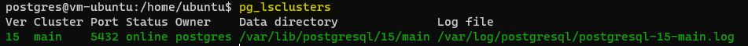
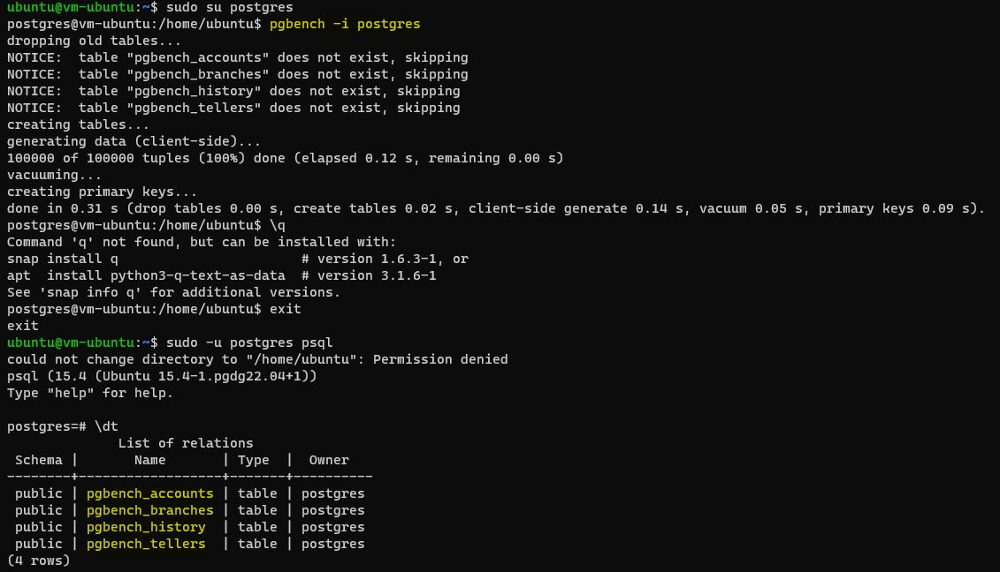
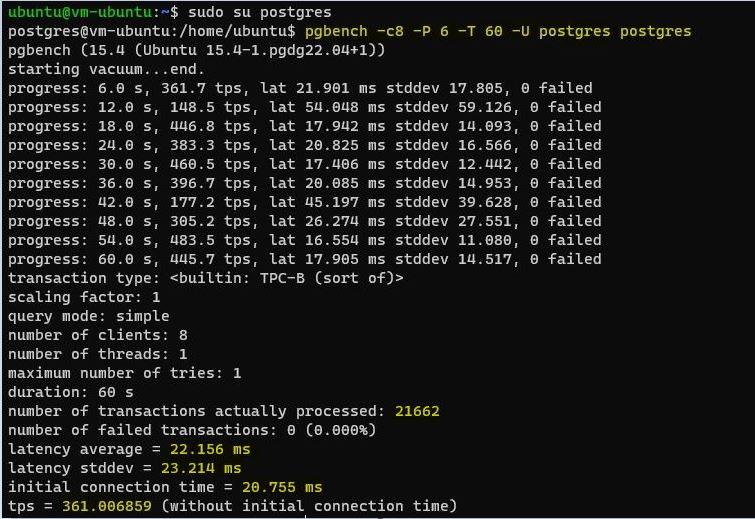

# Домашнее задание №5

Описание/Пошаговая инструкция выполнения домашнего задания:

* 1 cоздать инстанс ВМ с 2 ядрами и 4 Гб ОЗУ и SSD 10GB
* 2 Установить на него PostgreSQL 15 с дефолтными настройками
  > 
* 3 Создать БД для тестов: выполнить pgbench -i postgres
  > 
* 4 Запустить pgbench -c8 -P 6 -T 60 -U postgres postgres
 __*-c8 (Количество моделируемых клиентов, т. е. количество одновременных сеансов базы данных)*__
 __*-P 6 (Отображает отчет о ходе выполнения каждые N секунд)*__
 __*-T 60 (Выполняется тест в течение этого количества секунд, а не фиксированного количества транзакций на клиента)*__
 __*-U postgres postgres (Имя пользователя, к которому необходимо подключиться)*__
  > 
* 5 Применить параметры настройки PostgreSQL из прикрепленного к материалам занятия файла
__*Для настройки сервера использовал файл — postgresql.auto.conf.*__
* 6 Протестировать заново (pgbench -c8 -P 6 -T 60 -U postgres postgres)
* 7 Что изменилось и почему?
pgbench - это программа для запуска тестов производительности на PostgreSQL. Она выполняет одну и ту же последовательность команд SQL снова и снова, а затем вычисляет среднюю скорость транзакций (транзакций в секунду). 
Задав по-новому значения параметров настройки PostgreSQL, сервер был переконфигурирован. В результате TPS (средняя скорость транзакций?) снизилась с  361 до 305, количество обработанных транзакций за время теста тоже снизилось – с 21662 до 18351. 

Параметр «shared_buffer» - буфер PostgreSQL, этот параметр устанавливает, сколько выделенной памяти будет использоваться PostgreSQL для кеширования. До изменения «shared_buffer» был 128МБ, увеличили до 1ГБ. 
Значение для «min_wal_size» ограничивает снизу число файлов WAL, которые будут переработаны для будущего использования. До изменения min_wal_size был 80МБ, увеличили до 4ГБ. «max_wal_size» увеличили с 1ГБ до 16ГБ. 
Параметр «effective_cache_size» оценивает объем памяти, доступной для кэширования диска операционной системой и самой базой данных. 
Параметр «work_mem» - задаёт базовый максимальный объём памяти, который будет использоваться во внутренних операциях при обработке запросов (например, для сортировки или хеш-таблиц), прежде чем будут задействованы временные файлы на диске. 

* 8 Создать таблицу с текстовым полем и заполнить случайными или сгенерированными данным в размере 1млн строк
* 9 Посмотреть размер файла с таблицей
* 10 5 раз обновить все строчки и добавить к каждой строчке любой символ
* 11 Посмотреть количество мертвых строчек в таблице и когда последний раз приходил автовакуум 
SELECT relname, n_live_tup, n_dead_tup, trunc(100*n_dead_tup/(n_live_tup+1))::float "ratio%", last_autovacuum FROM pg_stat_user_TABLEs WHERE relname = 'test';
SELECT * FROM pg_stat_activity WHERE query ~ 'autovacuum' \gx
* 12 Подождать некоторое время, проверяя, пришел ли автовакуум
* 13 5 раз обновить все строчки и добавить к каждой строчке любой символ
* 14 Посмотреть размер файла с таблицей
SELECT pg_size_pretty(pg_total_relation_size('test'));
* 15 Отключить Автовакуум на конкретной таблице
* 16 10 раз обновить все строчки и добавить к каждой строчке любой символ
* 17 Посмотреть размер файла с таблицей
* 18 Объясните полученный результат
Таблица test сильно выросла в размерах. В процессе обновления 1млн. записей растет число «мертвых», то есть неактуальных, версий строк. Число мертвых версий постоянно собирается коллектором.   За последние 10 обновлений число таких строк увеличилось на 10млн., по 1млн. строк за каждый UPDATE. Все эти данные также хранятся в таблице, хоть мы их и не видим SELECTом.  Считается, что очистка необходима, если число «мертвых» версий строк превышает установленное пороговое значение. Так как мы отключили процесс Автовакуум для этой таблицы, то  мертвые версии строк не очищались. 
* 19 Не забудьте включить автовакуум)

